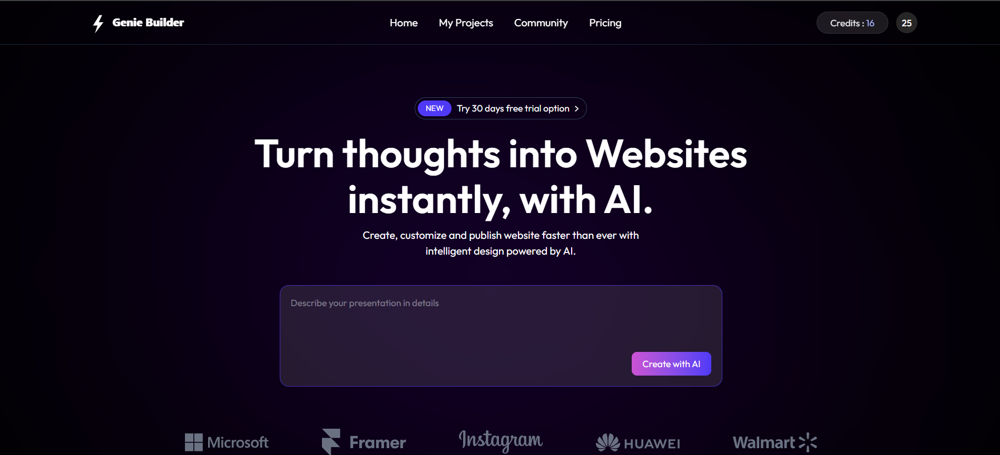
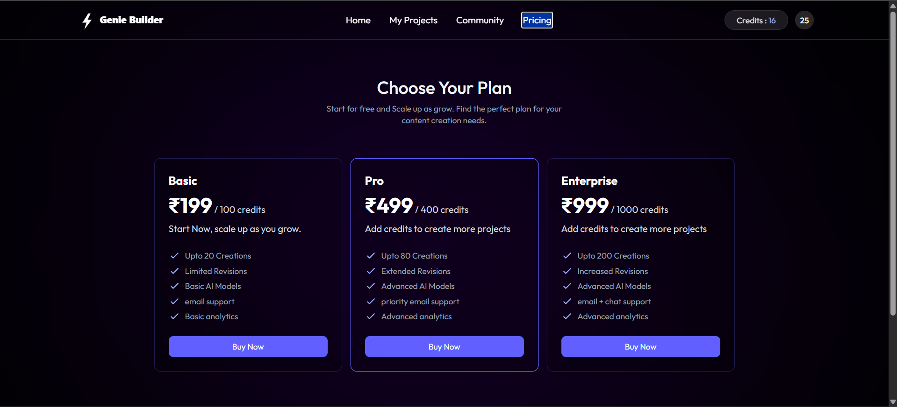
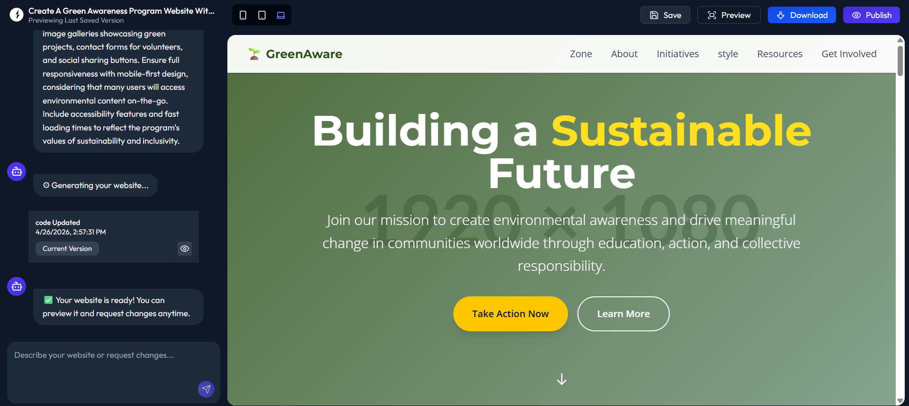

<div align="center">

# ✨ Genie AI Website Builder

### AI-Powered Full Stack Website Generation Platform

Generate complete websites from natural language prompts using AI.


</div>

---

# 📌 Overview

**Genie AI Website Builder** is an AI-powered SaaS application that transforms user prompts into websites.

It includes:

- AI-powered website generation  
- Authentication (Google/GitHub login)  
- Project management dashboard  
- Database-backed storage  
- Payment integration  
- Full-stack deployment support

---

# 🎥 Demo Video

## Watch Project Demo

👉 **Demo Video:**  
[Click here to watch the demo](YOUR_VIDEO_LINK_HERE)

If your demo video is uploaded in the repository:

```md
https://drive.google.com/file/d/1c2hlNz3Tu1F8qlsdBEnewcSxTgBRIVK2/view?usp=sharing
```

# 📷 Screenshots

Add screenshots here:

```md



```

---

# 🏗 Tech Stack

## Frontend
- React + Vite
- Tailwind CSS
- Axios

## Backend
- Node.js
- Express.js
- Prisma ORM

## Database
- PostgreSQL (Neon Supported)

## AI APIs
- OpenAI
- Anthropic

## Authentication
- Better Auth
- Google OAuth
- GitHub OAuth

## Payments
- Razorpay

---

# 📁 Project Structure

```bash
genie-ai-website-builder/
│
├── client/
│   ├── src/
│   └── public/
│
└── server/
    ├── prisma/
    ├── routes/
    ├── controllers/
    └── middleware/
```

---

# ⚙️ Setup

## Clone Repository

```bash
git clone https://github.com/yourusername/genie-ai-website-builder.git
cd genie-ai-website-builder
```

---

# 🔐 Environment Variables

## Client `.env`

```env
VITE_BASEURL=http://localhost:3000
```

Production:

```env
VITE_BASEURL=https://your-backend-url.onrender.com
```

---

## Server `.env`

```env
TRUSTED_ORIGINS=http://localhost:5173,http://localhost:3000

DATABASE_URL=your_postgres_url

BETTER_AUTH_SECRET=your_secret
BETTER_AUTH_URL=http://localhost:3000

GOOGLE_CLIENT_ID=
GOOGLE_CLIENT_SECRET=

GITHUB_CLIENT_ID=
GITHUB_CLIENT_SECRET=

OPENAI_API_KEY=
ANTHROPIC_API_KEY=

RAZORPAY_KEY_ID=
RAZORPAY_KEY_SECRET=
```

---

# 📦 Installation

## Install Frontend

```bash
cd client
npm install
```

## Install Backend

```bash
cd ../server
npm install
```

---

# ▶ Run Locally

## Backend

```bash
cd server
npm run dev
```

Runs on:

```bash
http://localhost:3000
```

---

## Frontend

Open new terminal:

```bash
cd client
npm run dev
```

Runs on:

```bash
http://localhost:5173
```

---

# 🏗 Build

Frontend:

```bash
npm run build
```

Backend:

```bash
npm run build
```

---

# 🚀 Deployment

Deploy backend on Render:

Set:

```env
NODE_ENV=production
DATABASE_URL=...
TRUSTED_ORIGINS=frontend_url
BETTER_AUTH_URL=backend_url
```

Deploy frontend on Vercel/Netlify.

---

# API Routes

## Health Check

```http
GET /
```

## Authentication

```http
/api/auth/*
```

## User

```http
/api/user/*
```

## Projects

```http
/api/project/*
```

---

# 🌟 Features

- Prompt → Website Generation  
- Authentication System  
- AI Integration  
- Project Dashboard  
- Payment Gateway  
- Full Stack SaaS Architecture

---

# 🔒 Security

- Never commit `.env`
- Store secrets in deployment environment variables
- Rotate compromised keys
- Use strong auth secrets

---

# 🛠 Useful Commands

Generate Prisma Client:

```bash
npx prisma generate
```

Push Schema:

```bash
npx prisma db push
```

Run Migrations:

```bash
npx prisma migrate dev
```

---

# 🤝 Contributing

```bash
Fork
Clone
Create Branch
Commit
Push
Open PR
```

---

# 📜 License

MIT License

---

<div align="center">

Built with ❤️ using React, Node, Prisma and AI

</div>
